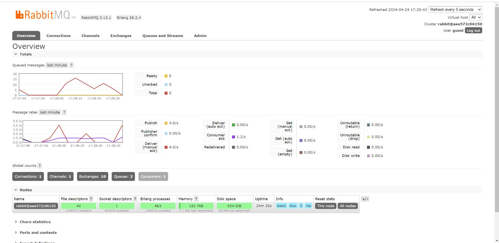

# Question

1. What is AMQP?
    - AMQP (Advance Message Queuing Protocol) adalah standar protokol untuk `message oriented middleware`. Hal ini memungkinkan aplikasi yang berbeda untuk berkomunikasi satu sama lain dan bertukar informasi dengan cara yang reliable, efficient, dan fleksibel untuk messaging protocol. AMQP umumnya digunakan di berbagai sistem terdistribusi, terutama dalam skenario yang memerlukan `high reliability and interoperability`.

2. What it means? guest:guest@localhost:5672 , what is the first quest, and what is the second guest, and what is localhost:5672 is for? 
    - guest:guest@localhost:5672 adalah default credential untuk akses RABBITMQ yang memiliki default port 5672. First guest mengartikan `username` dan second guest mengartikan `password`

- Banyaknya antrian disebabkan banyaknya pesan yang dikirim oleh publisher ke message broker, sementara itu belum semuanya diproses subscriber yang lebih lambat dibandingkan publisher. Oleh karena itu, semua pesan yang belum diproses disimpan dalam antrian. Pada mesin saya total queue adalah 15. Ini terjadi akibat subscribernya perlu waktu lebih lama untuk mengelola tiap event yang berada di message queue sehingga terjadi penumpukkan message karena lebih cepat publisher meng-publish message daripada subscriber membuat message.

- Three Subscriber

- Kita bisa melihat bahwa spike pesan yang tinggi telah berkurang. Ini disebabkan oleh setiap subscriber menerima data yang unik ketika publisher mengirimkan sejumlah besar data ke queue. Setiap pelanggan berfungsi seperti aplikasi tersendiri sehingga proses pengambilan data dari antrian pesan terpisah. Begitu data diambil dari antrian pesan, pesan akan dihapus dan tidak dapat digunakan oleh aplikasi lain.